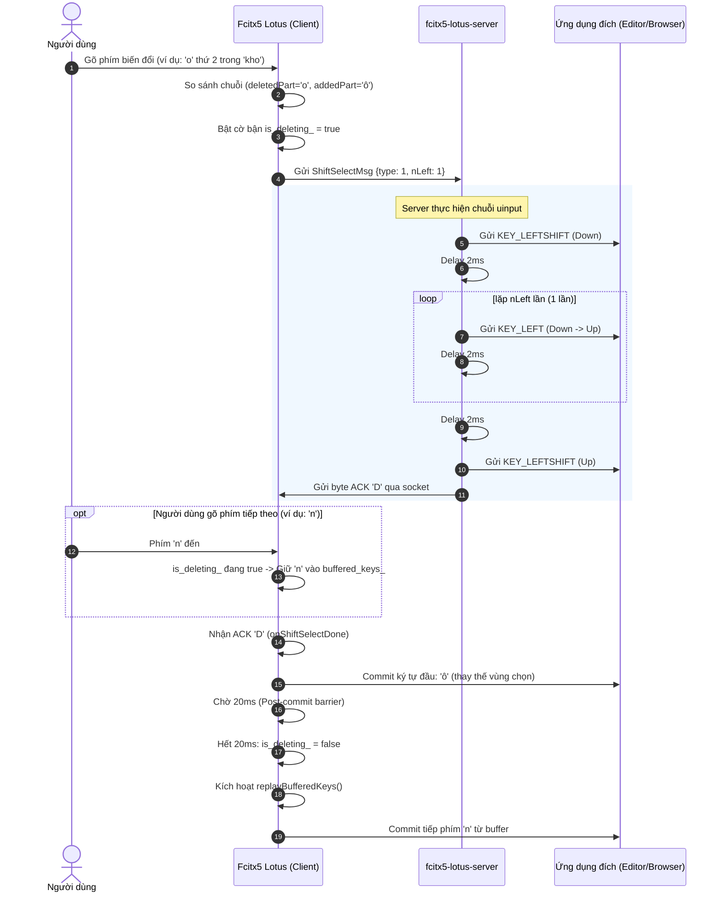

# Chế Độ Gõ Shift + Left Selection Rewrite (`UinputShiftSelect`)

Tài liệu kỹ thuật giải thích nguyên lý hoạt động, kiến trúc client-server, cơ chế đồng bộ hóa tuần tự (serialization) và bảo vệ chống reset (anti-reset) của chế độ viết lại văn bản bằng vùng chọn `Shift + Left` trong **Fcitx5 Lotus**.

---

## 1. Giới thiệu & Mục đích

Trong các bộ gõ tiếng Việt trên Linux, khi người dùng gõ thêm dấu hoặc thay đổi nguyên âm (ví dụ: gõ `o` tiếp theo chữ `o` để tạo thành `ô`), bộ gõ cần thay thế (rewrite) chuỗi ký tự đã hiển thị trên màn hình.

Trước đây, có hai cách tiếp cận chính:
1. **Dùng Surrounding Text**: Phụ thuộc vào ứng dụng có hỗ trợ Wayland/X11 Surrounding Text hay không (nhiều ứng dụng Electron, Chromium, Terminal hoặc Game không hỗ trợ hoặc hỗ trợ lỗi).
2. **Dùng Backspace (Uinput / Smooth / SuperSmooth)**: Gửi liên tiếp các phím `KEY_BACKSPACE` để xóa ký tự cũ rồi gõ lại ký tự mới. Cách này khi gõ nhanh dễ gây giật màn hình (flicker), nuốt phím, hoặc xung đột race condition nếu ứng dụng xử lý phím bất đồng bộ.

**Chế độ `UinputShiftSelect` (Shift + Left Selection Rewrite)** ra đời nhằm giải quyết triệt để các vấn đề trên:
- **Không dùng Backspace**: Thay vì bấm xóa nhiều lần, bộ gõ giả lập tổ hợp `Shift + Left` để **bôi đen (select)** đoạn ký tự cần thay thế, sau đó commit ký tự mới **đè trực tiếp** lên đoạn vừa chọn.
- **Mượt mà và ổn định**: Loại bỏ hiện tượng nhấp nháy chữ, giảm số lượng phím giả lập, tương thích tốt với hầu hết ứng dụng trên Wayland và X11.

---

## 2. Kiến Trúc & Quy Trình Hoạt Động (Flow)

Chế độ hoạt động theo mô hình Client-Server giao tiếp qua Unix Domain Socket:
- **Client**: Module Fcitx5 Lotus (`src/lotus-state.cpp`, `src/lotus-engine.cpp`).
- **Server**: Tiến trình daemon `fcitx5-lotus-server` chạy quyền root, truy cập trực tiếp vào `/dev/uinput`.

### Sơ đồ tuần tự (Sequence Diagram)



---

## 3. Chi Tiết Các Cơ Chế Cốt Lõi

### 3.1. Phía Server (`server/lotus-server.cpp`)

Khi nhận gói tin `ShiftSelectMsg`:
1. Nhấn giữ phím `KEY_LEFTSHIFT`.
2. Đợi **2ms** để OS và ứng dụng ghi nhận trạng thái Shift.
3. Lặp `nLeft` lần:
   - Gửi sự kiện `KEY_LEFT` (nhấn và nhả).
   - Đợi **2ms** sau mỗi phím Left.
4. Đợi **2ms** để hoàn tất vùng chọn.
5. Nhả phím `KEY_LEFTSHIFT`.
6. Gửi byte phản hồi `'D'` (Done ACK) qua socket về cho Fcitx5 client.

```cpp
// server/lotus-server.cpp
uinput_send_key(fd, KEY_LEFTSHIFT, 1);
std::this_thread::sleep_for(std::chrono::milliseconds(2));
for (int i = 0; i < msg.nLeft; ++i) {
    uinput_send_key(fd, KEY_LEFT, 1);
    uinput_send_key(fd, KEY_LEFT, 0);
    std::this_thread::sleep_for(std::chrono::milliseconds(2));
}
std::this_thread::sleep_for(std::chrono::milliseconds(2));
uinput_send_key(fd, KEY_LEFTSHIFT, 0);
::send(client_fd, "D", 1, MSG_NOSIGNAL);
```

### 3.2. Phía Client & Cơ Chế Commit Hai Giai Đoạn

Sau khi nhận được tín hiệu hoàn tất `'D'` từ server:
1. **Commit ký tự đầu tiên (`shiftSelectFirstChar_`)**: Ghi đè trực tiếp lên vùng đang được bôi đen.
2. **Commit các ký tự còn lại (`shiftSelectRestChars_`)**: Nếu chuỗi thay thế có nhiều hơn 1 ký tự (ví dụ thay `ung` -> `úng` thì commit `ú`, sau đó 5ms commit `ng`), các ký tự còn lại được commit qua timer phi chặn `EventLoop::addTimeEvent`.

### 3.3. Cơ Chế Chống Nuốt Phím & Đồng Bộ Tuần Tự (Sequencing)

Một vấn đề phổ biến khi gõ tốc độ cao (ví dụ gõ `k h o o n g` với phím `o` và `n` bấm gần như đồng thời):
- Phím `n` có thể bị gửi tới ứng dụng trước khi quá trình bôi đen và commit `ô` hoàn thành, dẫn tới từ bị đảo thành `khnôg`.

Để ngăn chặn hoàn toàn hiện tượng này:
1. **Cờ Bận `is_deleting_`**:
   - Khi bắt đầu rewrite hoặc commit, `is_deleting_` được đặt thành `true`.
   - Bất kỳ phím nào người dùng gõ trong khoảng thời gian này sẽ **bị chặn ngay lập tức** và đưa vào hàng đợi `buffered_keys_` bằng `filterAndAccept()`.
2. **Khóa logic Backspace hoàn tất**:
   - Kiểm tra `realMode != LotusMode::UinputShiftSelect && expected_backspaces_ > 0` để tránh việc `0 >= 0` làm tắt `is_deleting_` ngoài ý muốn.
3. **Post-commit Barrier (20ms)**:
   - Sau khi ký tự được commit, hệ thống **duy trì cờ `is_deleting_ = true` thêm 20ms**.
   - Hết 20ms này, timer mới gỡ cờ và kích hoạt `replayBufferedKeys()`.
4. **Xử lý tuần tự từng phím trong hàng đợi đệm (`replayBufferedKeys`)**:
   - Mỗi lần chạy, hệ thống chỉ lấy **duy nhất 1 phím** ở đầu hàng đợi ra xử lý.
   - Nếu phím đó dẫn tới commit (kể cả ký tự mới không có thay thế), hệ thống lại tiếp tục đặt cờ bận và hoãn 20ms trước khi cho phép phím tiếp theo được pump ra màn hình.

```cpp
// src/lotus-state.cpp - replayBufferedKeys()
if (realMode == LotusMode::UinputShiftSelect) {
    auto keyInfo = buffered_keys_.front();
    buffered_keys_.erase(buffered_keys_.begin());
    // ... Xử lý phím ...
    ic_->commitString(addedPart);
    is_deleting_.store(true, std::memory_order_release);
    scheduleShiftSelect(20, [this]() {
        is_deleting_.store(false);
        replayBufferedKeys();
    });
    return;
}
```

### 3.4. Cơ Chế Chống Reset Đột Ngột (Anti-Reset)

Khi Fcitx5 hoặc server uinput bơm các phím `Shift` hoặc phím di chuyển con trỏ `Left`, hệ thống hoặc ứng dụng có thể phát ra các sự kiện như reset trạng thái gõ, focus change, hoặc mouse click ảo.
Hàm `shouldRejectReset()` được triển khai để bảo vệ:
- Kiểm tra xem `is_deleting_` có đang bật hay không.
- Kiểm tra xem thời điểm hiện tại có nằm trong khoảng an toàn **50ms** kể từ lần commit cuối cùng (`lastCommitTimeUsec_`) hay không.
- Nếu thỏa mãn, mọi yêu cầu reset engine từ bên ngoài đều bị từ chối, bảo đảm tính toàn vẹn của lịch sử từ đang gõ.

```cpp
// src/lotus-utils.cpp
bool shouldRejectReset() {
    if (is_deleting_.load(std::memory_order_acquire)) {
        return true;
    }
    uint64_t last = lastCommitTimeUsec_.load(std::memory_order_acquire);
    if (last > 0) {
        uint64_t now = fcitx::now(CLOCK_MONOTONIC);
        if (now >= last && (now - last) < 50000ULL) { // 50ms
            return true;
        }
    }
    return false;
}
```

---

## 4. Bảng So Sánh Các Chế Độ Rewrite Trong Lotus

| Tiêu chí | Backspace Thường (`Uinput`/`Smooth`) | Surrounding Text | **Shift + Left Selection (`UinputShiftSelect`)** |
| :--- | :--- | :--- | :--- |
| **Cơ chế xóa** | Gửi N phím Backspace | Gọi API deleteSurroundingText | Gửi `Shift + Left` x N lần |
| **Hiện tượng nhấp nháy** | Có thể thấy chữ bị lùi và gõ lại | Không | Cực kỳ mượt (vùng chọn bị thay tức thì) |
| **Độ tương thích app** | Trung bình - Khá | Kém (nhiều app không hỗ trợ) | **Rất cao** (hầu hết app đều hỗ trợ Shift+Left) |
| **Độ ổn định khi gõ nhanh** | Dễ bị nuốt phím nếu máy lag | Dễ crash/mất focus trên app lỗi | **Rất cao** (có barrier 20ms và buffer tuần tự) |
| **Yêu cầu quyền** | Cần uinput server (root) | Không cần root | Cần uinput server (root) |

---

## 5. Hướng Dẫn Cấu Hình

1. Mở phần Cài đặt của **Fcitx5** -> Chọn cấu hình **Lotus**.
2. Tại mục **Chế độ viết lại (Rewrite Mode)**, chọn:
   ```text
   Uinput (Shift+Left Selection)
   ```
3. Cấu hình độ trễ:
   - `uinputShiftSelectDelayMs`: Thời gian chờ giữa lúc server bôi đen xong (nhận ACK 'D') và lúc client commit ký tự đầu tiên đè lên vùng chọn (mặc định: **20 ms**).

> **Lưu ý về 2 khoảng chờ 20ms trong quy trình**:
> 1. **Chờ sau khi bôi đen (Delay After Select - 20ms)**: Sau khi server gửi xong `Shift + Left`, hệ thống chờ 20ms để ứng dụng đích hiển thị hoàn tất vùng bôi đen rồi mới commit ký tự đầu tiên.
> 2. **Chờ sau khi commit (Post-commit Barrier - 20ms)**: Sau khi commit xong ký tự mới, hệ thống duy trì cờ bận thêm 20ms để ứng dụng đích ghi nhận văn bản hoàn tất rồi mới pump phím tiếp theo từ hàng đợi.
